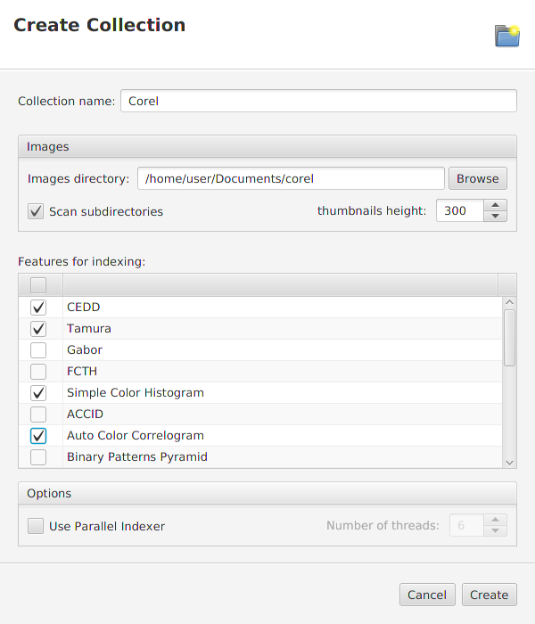
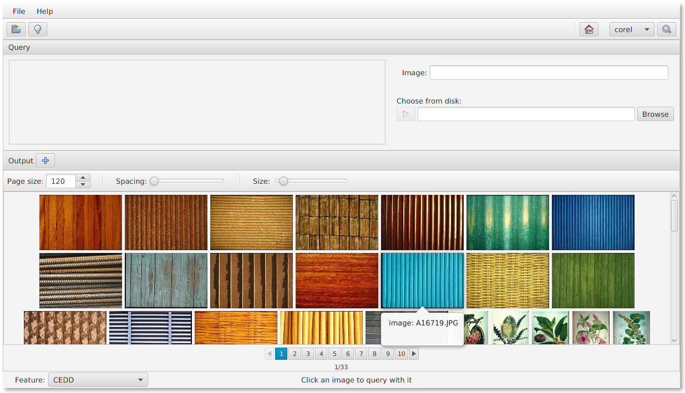

# What is LIRE-Lab?

LIRE-Lab is a desktop image-retrieval tool developed 
to allow testing and experimentation of the LIRE Java library.
With LIRE-Lab you can:

* Visually query a collection of images using the LIRE Features
* Run the same query with two Features simultaneously and compare the results

# Getting started

Follow this short tutorial to start using LIRE-Lab immediately.

## Welcome screen

When running LIRE-Lab for the first time, you will see a Welcome screen like the following:

## Create a collection

A Collection is a set of indexed images that you can run queries into. Speaking of
implementation, a collection is composed by a LIRE/Lucene index, a set of thumbnails
and some metadata in a collection.xml file. To create a collection, click the "New Collection"
button in the toolbar:

You can also create a collection through the equivalent item in the "File" menu.

The "Create Collection" dialog will show. You have to inform a collection name, 
the directory that contains the images, and select at least one Feature to index 
the collection. Click the "Create" button to start the collection creation process:

The creation process happens in two steps: first a LIRE/Lucene index is created, 
and then the image's thumbnails are generated. A dialog will show, informing the 
creation progress.

After the collection is created, it is displayed in the main area of the GUI. The
"Collections" pane in the left side lists all collections you have. The right side displays
the selected collection's basic information and images:

## Search the Collection

To start searching a collection, click the Search button at the toolbar:

You can also search a collection by clicking the search item at the collections context menu.

When searching a collection, LIRE-Lab will show the Search screen. This screen is divided 
in two areas: the "Query" pane at the top, and the "Output" pane at the bottom. The "Query"
pane shows the selected query image. The "Output" pane shows the resulting ordered collection.
Before you choose a query image, the output pane will show the collection without any ordering:

At the bottom of the Output pane there is a status bar. It contains a Feature
combobox, where you can select the LIRE Feature you'd like to use when querying. The
Feature combobox will show only the features chosen when the collection was created.

To run a query with an image from the collection itself, just click the image 
you'd like to search for. The collection will be ordered for visual similarity 
with the query image, according to the selected LIRE Feature:

The output pane contains a toolbar at the top that allows you to configure some visual 
aspects of the output pane, like the page size and spacing between images:

You can for example increase the gap between the images, using the correspondent slider:

You can also increase the images dimensions:

## Query simultaneously with two features

To run queries with two features simultaneously, click the "split" button in the Output bar.
The Output pane will be divided into two panes.

You can then select a different feature for each pane. 
After that, every query you run will be computed for the two panes, allowing you 
to visually compare the results of two features:

