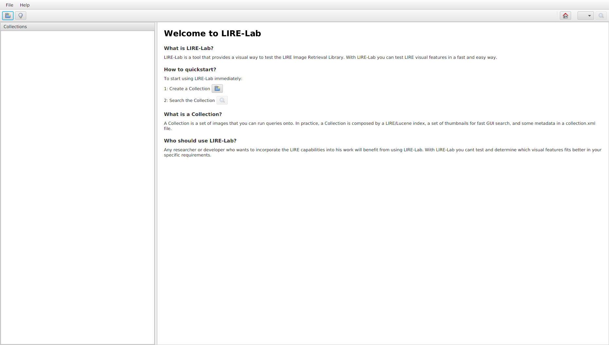
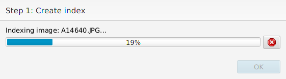
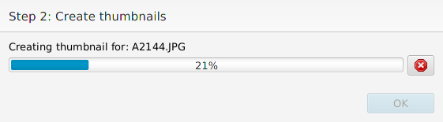
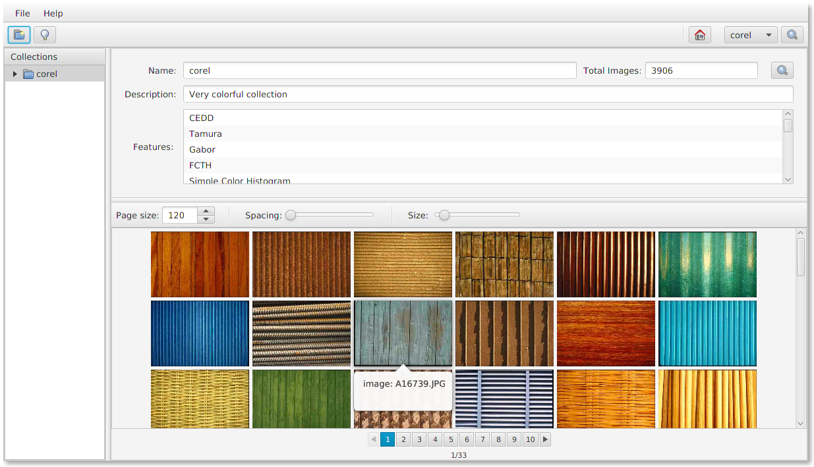
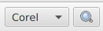
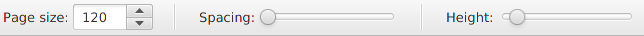
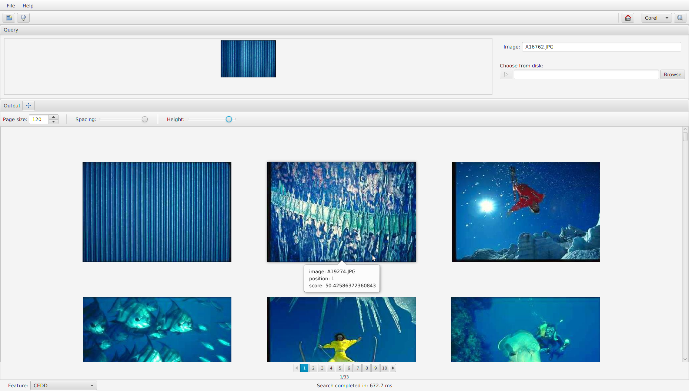
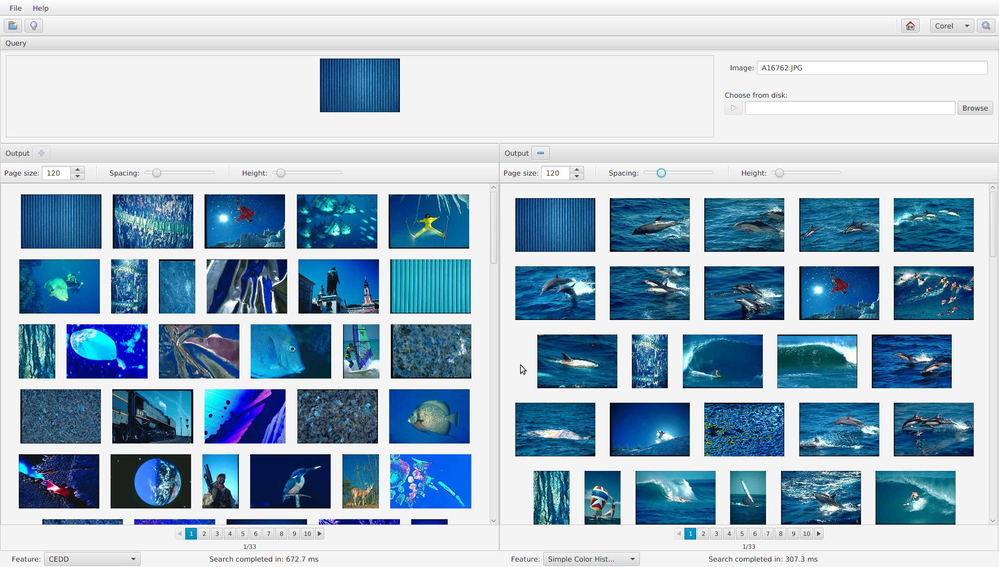

# What is LIRE-Lab?

LIRE-Lab is a desktop image-retrieval tool developed 
to allow testing and experimentation of the LIRE Java library.
With LIRE-Lab you can:

* Visually query a collection of images using the LIRE Features
* Run the same query with two Features simultaneously and compare the results

# Welcome screen

When running LIRE-Lab for the first time, you will see a Welcome screen like the following:

# Create a collection

A Collection is a set of indexed images that you can run queries onto. Speaking of
implementation, a collection is composed by a LIRE/Lucene index, a set of thumbnails
and some metadata in a collection.xml file. To create a collection, click the "New Collection"
button in the toolbar:

or the equivalent item in the "File" menu. The Create Collection dialog will show:

You have to inform a collection name, the directory that contains the images, and
select at least one Feature to index the collection. Click the Create button to
start the collection creation. A dialog will show informing the creation progress:

After the collection is created, it is shown in the main area of the GUI. The
"Collections" pane in the left lists all collections you have. The right area shows
the selected collection's information and images.

# Search Collection

To start searching a collection, click the Search button at the toolbar:

You can also search a collection by clicking the search item at the collections context menu.
When searching a collection, LIRE-Lab will show the Search screen. This screen is divided 
in two main areas: the query pane at the top, and the output pane at the bottom. The query
pane shows the selected query image. The output bottom shows the resulting ordered collection.
Before you choose a query image, the output pane will show the collection without any ordering:

To run a query with an image from the collection itself, just click the image 
you'd like to search the collection for. The collection will then be ordered 
for similarity with the query image according to the selected LIRE Feature indicated 
in the left bottom area of the status bar

The output pane contains a toolbar that allows you to configure some visual aspects of
the output pane, like the page size and spacing between images 

You can for example increase the gap between the images:

You can also increase the images dimensions:

To split the output into two panes, click the "plus" button in the Output title:

After that, every query you run will be computed in the two panes, allowing you 
to compare the results of two Features:

